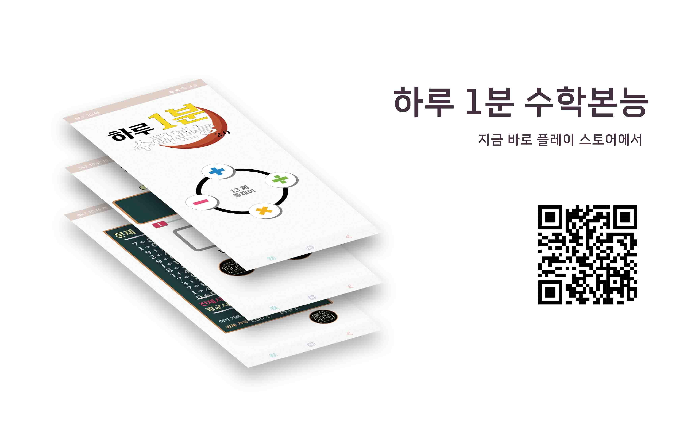
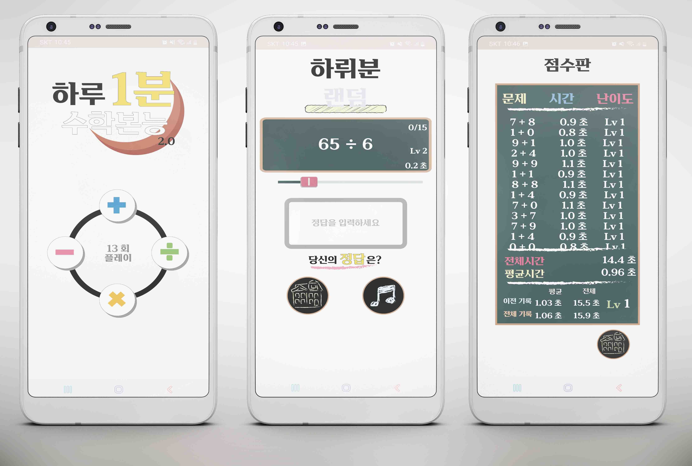
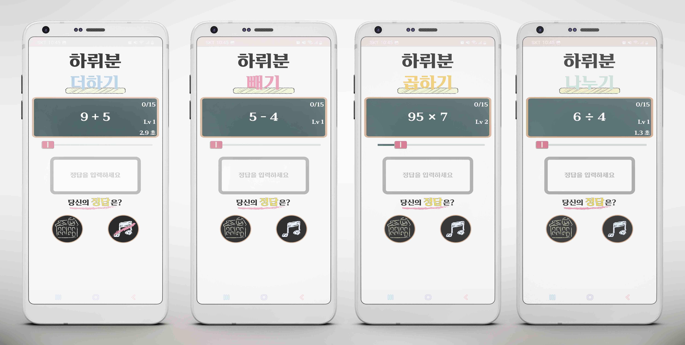

## 하루 1분 수학 본능 (OneDayMath)

### 프로젝트 진행 기간 : 2022. 12. 19. ~ 2022. 12. 22.

## 📜 History

- 안드로이드 프로젝트 개발 시작(2022. 12. 19)
- Android Apk 생성 완료 (2022. 12. 23.)

## 💻 Libraries and Frameworks

- 이번 프로젝트는 아래의 기술 스택이 사용되었습니다.
- This application is made of
  - Kotlin
  - Gradle
  - SQLite
  - Android Studio

## 🔍 프로젝트 개요 (Project Overview)

바쁜 일상 속 반복 되는 업무로부터 당신의 두뇌는 안녕하십니까?
이 게임은 간단한 사칙 연산 게임을 통해 두뇌를 맑게 해줄 것입니다. 사용자의 학습 패턴을 통계적으로 분석하여 과거와 기록과 비교하여 성취감을 느낄 수 있고, 분석이 가능한 객관적 정보를 제공합니다.
지금 바로 하루 1분을 마음 껏 즐겨보세요! 😀

## 하루 1분 수학 본능 서비스 화면

### 지금 바로 플레이 스토어에서 즐겨보세요! 😆

https://play.google.com/store/apps/details?id=co.kr.onedaymath

### 플레이 영상

플레이 영상

	https://user-images.githubusercontent.com/79094527/210573059-e9b5cc1a-5ed3-4256-9dad-f6a29602cede.mp4

### Contributor

- 1-hee : onehee9710@gmail.com
